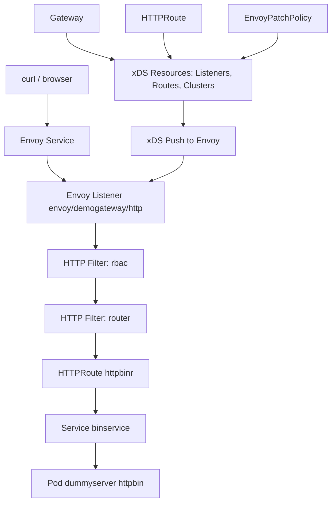

# Envoy Gateway + httpbin Demo

This repo contains a minimal setup to run httpbin behind Envoy Gateway using the Kubernetes Gateway API and an EnvoyPatchPolicy to inject an RBAC HTTP filter.

## Components

- Namespace `envoy` with:
  - `dummyserver` Deployment running `httpbin`
  - `binservice` ClusterIP Service exposing `httpbin`
- Envoy Gateway control-plane in namespace `envoy-gateway-system`
- Gateway API resources in namespace `envoy`:
  - GatewayClass `envoy`
  - Gateway `demogateway`
  - HTTPRoute `httpbinr`
- EnvoyPatchPolicy `httpbinpolicy` targeting `demogateway` to inject an RBAC filter on the HTTP listener.

## Minimal Architecture


Envoy Gateway watches Gateway/HTTPRoute and EnvoyPatchPolicy, translates them into xDS resources (Listeners, Routes, Clusters) and pushes them to Envoy via xDS. The EnvoyPatchPolicy modifies the generated Listener config using JSONPatch so that the RBAC filter is inserted before the router filter.

## Step-by-step Setup
All commands assume your current context points to the demo cluster.

1. **Create the backend (httpbin + Service)**

```bash
kubectl apply -n envoy -f dummyfront/httpbin.yaml
kubectl get pods -n envoy
kubectl get svc -n envoy
```

Ensure `dummyserver` pod is `Running` and the `binservice` Service exists.

2. **Install Envoy Gateway (if not already installed)**

Example (v1.0.0):

```bash
kubectl apply --server-side -f \
  https://github.com/envoyproxy/gateway/releases/download/v1.0.0/install.yaml

kubectl get pods -n envoy-gateway-system
```

Wait until `envoy-gateway` and the data-plane `envoy-envoy-demogateway-*` pods are `Running`.

3. **Apply GatewayClass, Gateway, and HTTPRoute**

```bash
kubectl apply -f envoygateway/gateway.yaml

kubectl get gatewayclass
kubectl get gateway -n envoy
kubectl get httproute -n envoy
```

The Gateway `demogateway` should show a listener `http` with `AttachedRoutes=1`.

4. **Enable EnvoyPatchPolicy in EnvoyGateway config**

Edit/apply `envoygateway/envoy-config.yaml` so it contains:

```yaml
apiVersion: gateway.envoyproxy.io/v1alpha1
kind: EnvoyGateway
provider:
  type: Kubernetes
gateway:
  controllerName: gateway.envoyproxy.io/gatewayclass-controller
extensionApis:
  enableEnvoyPatchPolicy: true
```

Create/update the ConfigMap used by Envoy Gateway:

```bash
kubectl apply -f envoygateway/envoy-config.yaml
```

Then restart the Envoy Gateway deployment so it picks up the new config:

```bash
kubectl rollout restart deployment/envoy-gateway -n envoy-gateway-system
kubectl rollout status deployment/envoy-gateway -n envoy-gateway-system
```

5. **Apply EnvoyPatchPolicy (RBAC filter)**

```bash
kubectl apply -f envoygateway/patchpolicy.yaml
kubectl get envoypatchpolicy -n envoy
```

A typical policy injects `envoy.filters.http.rbac` into the listener `envoy/demogateway/http` and configures rules such as:

- Allow only `GET /get` when request header `x-role: admin` is present.
- Deny other requests by default.

6. **Expose Envoy and test traffic**

Identify the Envoy data-plane Service created by Envoy Gateway (type `LoadBalancer`):

```bash
kubectl get svc -n envoy-gateway-system
```

Port-forward it locally (example name):

```bash
kubectl port-forward -n envoy-gateway-system \
  svc/envoy-envoy-demogateway-02287898 8080:80
```

Test requests:

```bash
# Expected: 403 (blocked by RBAC)
curl -i http://127.0.0.1:8080/get

# Expected: 200 (allowed)
curl -i -H 'x-role: admin' http://127.0.0.1:8080/get
```

## How the Patch Works (xDS Flow)

1. You create Gateway, HTTPRoute, and EnvoyPatchPolicy in Kubernetes.
2. Envoy Gateway controller watches these resources.
3. It translates them into an internal IR and then into Envoy xDS resources:
   - Listeners
   - RouteConfigurations
   - Clusters
4. When EnvoyPatchPolicy is enabled and valid, the controller:
   - Locates the target xDS resource, e.g. Listener `envoy/demogateway/http`.
   - Applies the configured JSONPatch operation(s) to its JSON representation.
   - The patch adds the RBAC filter into `default_filter_chain.filters[0].typed_config.http_filters` before the router.
5. Envoy receives the updated Listener config over xDS and enforces RBAC at request time.

## Basic Troubleshooting Guide

### 1. Check core resources

```bash
kubectl get gatewayclass
kubectl get gateway -n envoy -o wide
kubectl get httproute -n envoy -o wide
kubectl get envoypatchpolicy -n envoy -o wide
```

- Gateway listener `Programmed=True` and `AttachedRoutes>0` indicates routing is set up.
- EnvoyPatchPolicy should show `Programmed=True` when applied.

### 2. Check Envoy Gateway and Envoy pods

```bash
kubectl get pods -n envoy-gateway-system -o wide

kubectl logs deployment/envoy-gateway -n envoy-gateway-system | head -50
kubectl logs <envoy-envoy-demogateway-pod> -n envoy-gateway-system -c envoy | head -40
```

Look for obvious errors and ensure both control-plane and data-plane pods are running.

### 3. Verify EnvoyPatchPolicy is enabled

```bash
kubectl get configmap envoy-gateway-config -n envoy-gateway-system -o yaml
```

Confirm `extensionApis.enableEnvoyPatchPolicy: true` is present under `envoy-gateway.yaml`. If you change it, restart `envoy-gateway`.

### 4. Inspect Envoy live configuration (xDS)

Port-forward the Envoy admin port and fetch the config dump:

```bash
kubectl port-forward -n envoy-gateway-system <envoy-envoy-demogateway-pod> 19000:19000

curl -s http://127.0.0.1:19000/config_dump > config_dump.json
```

Search for your listener and HTTP filters:

```bash
grep -n 'envoy/demogateway/http' config_dump.json
```

Within that listener, you should see an `http_filters` array containing `envoy.filters.http.rbac` before `envoy.filters.http.router`.

### 5. Validate responses and status codes

```bash
# Just status code
curl -o /dev/null -s -w '%{http_code}\n' http://127.0.0.1:8080/get

# Full headers
curl -i http://127.0.0.1:8080/get
```

- 403 indicates RBAC is denying the request.
- 200 indicates the request passed through.

### 6. Common gotchas

- EnvoyPatchPolicy not enabled in EnvoyGateway config → policy objects exist but no effect.
- EnvoyPatchPolicy `targetRef` does not match the Gateway → patches never applied.
- Listener `name` in `jsonPatches[*].name` must match exactly (e.g. `envoy/demogateway/http`).
- JSONPatch `path` must match the actual Listener JSON shape; otherwise it is ignored.

This README is intentionally brief and focused on the demo in this repo. For advanced usage and additional patch examples, see the official Envoy Gateway EnvoyPatchPolicy documentation.
